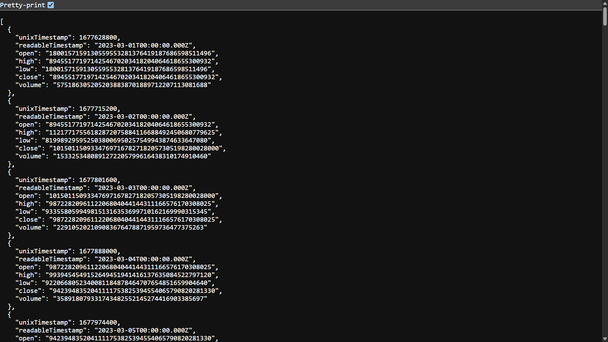
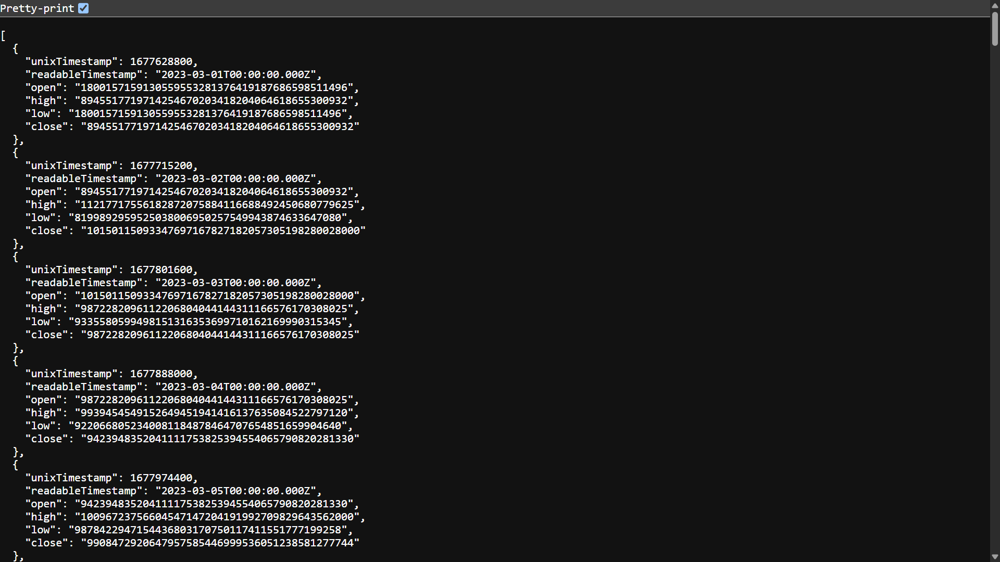
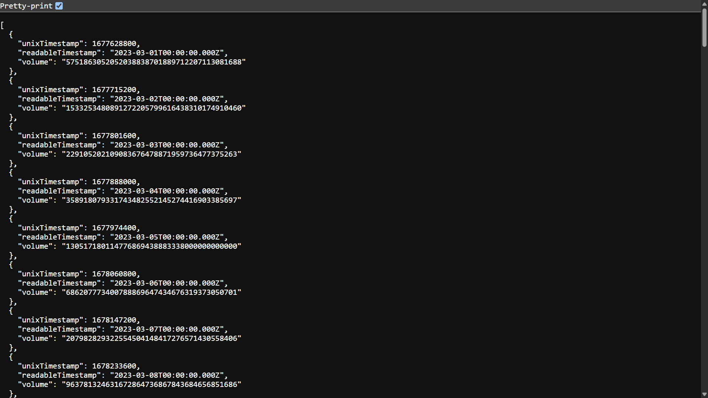

# Historical Market Data Project

This project provides a comprehensive solution for collecting, processing, and serving historical market indicators for a token, including price, volume, and liquidity. The data is collected from the token's genesis and aggregated with hourly granularity, making it suitable for in-depth market analysis and project submissions requiring detailed historical data.

## Project Components

### 1. Data Collection (`index.ts`)

The `index.ts` script is responsible for interacting with a smart contract to fetch raw transaction data and process it into a structured format. It utilizes `ethers` for blockchain interaction and `csv-stringify` to store the processed data in `candle_data.csv`.

**Key Features:**
- Connects to an Ethereum-compatible blockchain via an RPC URL.
- Fetches historical transaction data from a specified smart contract.
- Calculates various market indicators such as `totalTx`, `txTimeStamp`, `candleStickData` (Open, High, Low, Close), and `tVol` (total volume).
- Aggregates data into daily and cumulative volumes.
- Stores the aggregated data in `candle_data.csv` for persistent storage and further analysis.

**Usage:**
To run the data collection script, execute the following command from the `final` directory:


## Visualizations

### OHLC + Volume


### OHLC


### Volume
bash
npm run process-data
```
The script will prompt you for the RPC URL and the Contract Address.

### 2. API Service (`api.ts`)

The `api.ts` file implements an Express.js server that exposes the processed historical market data via a set of RESTful API endpoints. It reads the `candle_data.csv` file, aggregates the data based on requested timeframes, and serves it in JSON format.

**Key Features:**
- Provides dynamic API endpoints for different timeframes (e.g., `1m`, `1h`, `1d`).
- Supports retrieval of OHLCV (Open, High, Low, Close, Volume), OHLC, and Volume-only data.
- Offers an option to return full-precision numbers as strings by appending `?format=string` to the API calls.
- Aggregates data from `candle_data.csv` into user-defined timeframes.

**Available Endpoints:**

*   `/api/candles/:timeframe`: Provides Open, High, Low, Close (OHLC) and Volume data for a given timeframe.
*   `/api/ohlc/:timeframe`: Provides OHLC data for a given timeframe.
*   `/api/volume/:timeframe`: Provides volume data for a given timeframe.

**Supported Timeframes:**

`:timeframe` can be one of the following: `1m`, `5m`, `15m`, `30m`, `45m`, `1h`, `2h`, `3h`, `4h`, `5h`, `6h`, `12h`, `15h`, `18h`, `1d`.

**Data Format Option:**

Append `?format=string` to any endpoint to receive full precision numbers (as strings) instead of floating-point numbers.

**Example Usage:**
```
GET /api/candles/1h
GET /api/ohlc/1d?format=string
GET /api/volume/5m
```

**Usage:**
To start the API server, execute the following command from the `final` directory:
```bash
npm run start-api
```
The server will be accessible at `http://localhost:3000`.

### 3. Liquidity Analysis (`liquidity/app.py`)

The `liquidity/app.py` Python script is designed to analyze the total token liquidity of a smart contract by tracking 'Transfer' events from a CSV log file (e.g., `history.csv`). It calculates hourly net changes in liquidity and maintains a running cumulative total.

**Key Features:**
- Parses raw log data to identify 'Transfer' events.
- Extracts `from`, `to`, and `value` from transfer events.
- Calculates hourly net changes in liquidity based on token inflows and outflows to the specified contract address.
- Provides a chronological breakdown of hourly net changes and cumulative liquidity.

**Usage:**
To run the liquidity analysis, execute the Python script from the `liquidity` directory. Ensure `history.csv` (containing raw transfer logs) is present in the same directory.

```bash
python liquidity/app.py
```

### `contract.sol`

This Solidity smart contract (`0.8.17`) serves as the core of the token's functionality, incorporating features such as `ReentrancyGuard`, `IERC20` compliance, and `Ownable` access control. It includes a `DividendDistributor` for managing token distributions and dividends. Key functionalities include:

*   **Token Management**: Standard BEP-20 token operations.
*   **Dividend Distribution**: Mechanisms for distributing dividends to token holders.
*   **Liquidity Management**: Functions for handling liquidity, including adding and removing.
*   **Fee Adjustments**: Owner-only functions to modify various fees (e.g., buy, sell, transfer).
*   **Tax Distribution**: Logic for distributing taxes collected from transactions.
*   **Market Cap & Price Calculation**: Functions to calculate the token's market capitalization and price.
*   **Trading Control**: Owner-only functions to enable/disable trading and manage liquidity.

The contract also details the `_sell` function's handling of burning and dividend distribution, along with functions for retrieving liquidity and holdings value. Owner-only functions allow for changing fees, tax distribution, fee receivers, withdrawing tax balance, and managing liquidity and trading.

#### Data Storage within the Contract

The `contract.sol` primarily stores data related to token balances, allowances, and dividend distribution, as well as historical market indicators. It utilizes several mappings and state variables to manage this information:

*   **Token Balances**: `_balances` (mapping from address to uint256) stores the balance of each token holder.
*   **Allowances**: `_allowances` (mapping from address to mapping from address to uint256) manages token allowances for spending by other addresses.
*   **Dividend Distribution**: The `DividendDistributor` contract, integrated within `contract.sol`, handles the distribution of dividends. It likely stores data related to:
    *   `lastProcessedIndex`: Tracks the last processed token holder for dividend distribution.
    *   `realtimeDividendPerShare`: Stores the real-time dividend amount per share.
    *   `totalDistributedDividends`: Accumulates the total dividends distributed.
    *   `shares`: A mapping to track the number of shares (tokens) held by each address for dividend calculation.
    *   `withdrawnDividends`: A mapping to track dividends already withdrawn by each address.
*   **Fees and Taxes**: State variables are used to store various fee percentages (e.g., `_buyFee`, `_sellFee`, `_transferFee`) and tax-related parameters.
*   **Ownership**: The `Ownable` contract uses a state variable (`_owner`) to store the address of the contract owner, controlling access to sensitive functions.
*   **Exclusion Lists**: Mappings like `_isExcludedFromFees` and `_isExcludedFromDividends` store addresses that are exempt from certain fees or dividend distributions.
*   **Volume Trackers**:
    *   `tVol` (mapping from `uint256` timestamp to `uint256` volume): Stores the total volume for a given timestamp.
    *   `totalVolume` (`uint256`): Accumulates the overall total trading volume.
*   **Candlestick Data**:
    *   `totalTx` (`uint256`): Tracks the total number of transactions.
    *   `txTimeStamp` (mapping from `uint256` transaction index to `uint256` timestamp): Records the timestamp for each transaction.
    *   `candleStickData` (mapping from `uint256` timestamp to `candleStick` struct): Stores Open, High, Low, and Close prices for specific timestamps.

The contract directly stores these historical market indicators, which are updated with each relevant transaction on the blockchain. Off-chain scripts like `index.ts` and `liquidity/app.py` then process and aggregate this on-chain data for further analysis and presentation.

## How to Use

### 1. Data Collection (`index.ts`)

To collect historical market data, navigate to the `final` directory and run the `index.ts` script. This script will prompt you for an RPC URL and the contract address.

```bash
npm run process-data
```

Upon successful execution, a `candle_data.csv` file will be generated in the `final` directory, containing the processed historical market indicators.

### 2. API Service (`api.ts`)

The `api.ts` script provides a RESTful API to serve the collected historical market data. To start the API server:

```bash
npm start
```

The API server will run on `http://localhost:3000`. You can access the following endpoints:

*   **Candle Data (OHLCV)**: `/api/candles/:timeframe` (e.g., `/api/candles/1h`, `/api/candles/4h`, `/api/candles/1d`)
*   **OHLC Data**: `/api/ohlc/:timeframe` (e.g., `/api/ohlc/1h`, `/api/ohlc/4h`, `/api/ohlc/1d`)
*   **Volume Data**: `/api/volume/:timeframe` (e.g., `/api/volume/1h`, `/api/volume/4h`, `/api/volume/1d`)

Replace `:timeframe` with the desired granularity (e.g., `1h` for 1-hour, `4h` for 4-hour, `1d` for 1-day). You can also append `?format=string` to the URL to receive full-precision numbers as strings.

**Example:**
*   `http://localhost:3000/api/candles/1h`
*   `http://localhost:3000/api/ohlc/1d?format=string`

### 3. Liquidity Data Collection (`liquidity/getHistory.ts`)

To collect historical 'Transfer' events for liquidity analysis, navigate to the `liquidity` directory and run the `getHistory.ts` script. This script will fetch relevant blockchain events and generate a `history.csv` file.

```bash
npm run get-history
```

### 4. Liquidity Analysis (`liquidity/app.py`)

Once `history.csv` is generated, you can analyze token liquidity. Ensure `history.csv` is present in the `liquidity` directory. Then, run the `app.py` script:

```bash
python liquidity/app.py
```

This script will output an hourly breakdown of liquidity changes and a final cumulative liquidity total to the console.

## Data Flow

1.  **`contract.sol` (On-chain Data Source)**:
    *   The smart contract stores real-time token balances, allowances, and critical historical market indicators such as `tVol`, `totalTx`, `txTimeStamp`, and `candleStickData` directly on the blockchain.
    *   These indicators are updated with every relevant transaction (e.g., buys, sells) that occurs on the blockchain.

2.  **`index.ts` (Off-chain Data Collection and Processing)**:
    *   This TypeScript script interacts with the deployed `contract.sol` on the blockchain using an RPC URL and the contract address.
    *   It fetches raw transaction data and the on-chain historical market indicators (`tVol`, `candleStickData`, `txTotal`).
    *   It processes and aggregates this data, calculating daily and cumulative volumes.
    *   The processed data is then written to `candle_data.csv` in a structured format.

3.  **`api.ts` (Data Serving API)**:
    *   This Node.js Express application reads the `candle_data.csv` file generated by `index.ts`.
    *   It exposes RESTful API endpoints (`/api/candles`, `/api/ohlc`, `/api/volume`) to serve the historical market data.
    *   Users can query this API for various timeframes and data formats (e.g., OHLCV, OHLC, Volume, with optional full-precision strings).

4.  **`liquidity/getHistory.ts` (Liquidity Event Collection)**:
    *   This TypeScript script is responsible for fetching historical 'Transfer' events from the blockchain.
    *   It processes these events and outputs them into a `history.csv` file.

5.  **`liquidity/app.py` (Liquidity Analysis)**:
    *   This Python script analyzes token liquidity by processing 'Transfer' events from the `history.csv` file generated by `getHistory.ts`.
    *   It calculates hourly net changes and cumulative totals for liquidity.
    *   The `liquidity/abi.json` file provides the necessary Application Binary Interface for interpreting contract events related to liquidity.

This integrated flow ensures that on-chain data is efficiently collected, processed off-chain, and then made accessible through a user-friendly API for analysis and consumption.

This project focuses on providing the following historical market indicators with **hourly granularity** from the **genesis of the token** until the present:

-   **Price History**: `[timestamp, price][]`
    -   The `api.ts` provides OHLC (Open, High, Low, Close) data, which can be used to derive price history. The `index.ts` script collects this data from the smart contract.
-   **Volume History**: `[timestamp, 24-hour volume][]`
    -   The `api.ts` provides volume data, and `index.ts` collects `tVol` (total volume) from the smart contract, which is then aggregated.
-   **Liquidity History**: `[timestamp, liquidity][]` (Bonus)
    -   The `contract.sol` includes a `getLiquidity()` function, which can be used to track the token's liquidity over time. The `liquidity/app.py` script provides a method to analyze liquidity changes from raw transfer logs. The `liquidity/abi.json` file contains the ABI necessary to interact with the contract and retrieve liquidity-related data. The `liquidity/candle_data.csv` file, generated by `index.ts`, also contains volume data that can be correlated with liquidity.

## Setup and Installation

1.  **Clone the repository**:
    ```bash
    git clone https://github.com/parzivalishan/Mobula
    cd final
    ```
2.  **Install Dependencies**:
    ```bash
    npm install
    ```
3.  **Compile TypeScript (Optional, but recommended)**:
    ```bash
    npx tsc
    ```

## Project Structure

```
final/
├── api.ts
├── contract.sol
├── index.ts
├── package.json
├── tsconfig.json
├── candle_data.csv (generated after running index.ts)
└── liquidity/
    ├── app.py
    ├── abi.json
    └── history.csv (required for app.py)
```
